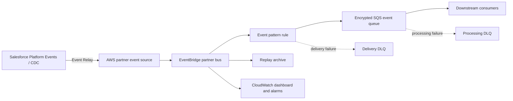

# Salesforce Event Relay on AWS

Production-oriented Terraform module for receiving Salesforce Platform Events and Change Data Capture (CDC) events through the native Salesforce Event Relay integration with Amazon EventBridge.

The module associates a Salesforce partner event source, filters events, delivers them to an encrypted durable queue, preserves failures in separate dead-letter queues, archives events for replay, and creates operational metrics and alarms.



## Why this module

- Uses the native Salesforce and AWS integration instead of custom polling or webhook middleware.
- Separates EventBridge delivery failures from downstream processing failures.
- Enables replay with an EventBridge archive.
- Encrypts all queues with SQS-managed server-side encryption and denies insecure transport.
- Grants EventBridge access with source ARN and source account conditions.
- Exposes a least-privilege consumer IAM policy.
- Provides throughput, backlog, latency, and failure metrics without logging Salesforce payloads.
- Supports schema discovery as an explicit opt-in.

## Prerequisites

1. A Salesforce org with Event Relay and the required Platform Event or CDC channel configured.
2. An Event Relay configuration that has created a pending EventBridge partner event source.
3. Terraform 1.7 or later and AWS provider 6.0 or later.
4. AWS permissions to manage EventBridge, SQS, CloudWatch, EventBridge Schemas, and related resource policies.

See [Salesforce setup](docs/salesforce-setup.md) for the required sequence.

## Usage

```hcl
module "salesforce_event_relay" {
  source  = "app.terraform.io/Murali_Seelam/salesforce-event-relay/aws"
  version = "1.0.0"

  partner_event_source_name_prefix = "aws.partner/salesforce.com/00Dxxxxxxxxxxxxxxx/0YLxxxxxxxxxxxxxxx"
  name                             = "customer-cdc"

  event_pattern = jsonencode({
    "detail-type" = [
      "AccountChangeEvent",
      "ContactChangeEvent"
    ]
    detail = {
      payload = {
        ChangeEventHeader = {
          changeType = ["CREATE", "UPDATE", "DELETE", "UNDELETE"]
        }
      }
    }
  })

  enable_schema_discovery = true
  alarm_actions           = [aws_sns_topic.platform_alerts.arn]

  tags = {
    Application = "salesforce-integration"
    Environment = "production"
    Owner       = "platform-engineering"
  }
}
```

The partner source prefix must match exactly one source. If the source was already associated manually, set `associate_partner_event_source = false`. If an existing association should become Terraform-managed, import the event bus instead of creating a second one:

```shell
terraform import 'module.salesforce_event_relay.aws_cloudwatch_event_bus.salesforce[0]' \
  'aws.partner/salesforce.com/00Dxxxxxxxxxxxxxxx/0YLxxxxxxxxxxxxxxx'
```

## Event filtering

When `event_pattern` is null, the module matches every event from the discovered Salesforce source. A dedicated partner bus receives only that partner source, but explicit filters are recommended to reduce downstream cost and scope.

Salesforce Event Relay places the Salesforce record under `detail.payload`, so CDC filtering can use `detail-type` and fields in `detail.payload.ChangeEventHeader`. This differs from the flatter Amazon AppFlow event envelope shown in some AWS examples. Custom Platform Events can use their event type and fields under `detail.payload`. Validate patterns against representative non-production events before enabling production consumers.

## Consumer access

Attach `consumer_iam_policy_json` to the IAM role used by the Lambda function, ECS task, Kubernetes workload, or other queue consumer:

```hcl
resource "aws_iam_role_policy" "salesforce_consumer" {
  name   = "consume-salesforce-events"
  role   = aws_iam_role.consumer.id
  policy = module.salesforce_event_relay.consumer_iam_policy_json
}
```

The consumer should delete a message only after successful processing. After `max_receive_count` failed receives, SQS moves the message to the processing DLQ.

## Operational behavior

| Failure point | Destination | Signal |
|---|---|---|
| EventBridge retries delivery to SQS | EventBridge retry queue | `RetryInvocationAttempts` alarm |
| EventBridge cannot deliver to SQS | Delivery DLQ | `InvocationsSentToDlq` alarm |
| EventBridge cannot write to its DLQ | Event is at risk | `InvocationsFailedToBeSentToDlq` alarm |
| A consumer repeatedly fails | Processing DLQ | DLQ depth alarm |
| Consumers fall behind | Main queue | Oldest-message alarm |

See the [operations runbook](docs/operations.md) before deploying to production.

## Security and data handling

Salesforce events can contain personal or regulated data. This module does not write event payloads to CloudWatch Logs. Queues use SQS-managed encryption, queue policies deny non-TLS requests, and EventBridge permissions are constrained to the managed rule and AWS account.

Restrict Terraform state access because state contains resource metadata. Do not put Salesforce credentials, access tokens, event payloads, or customer records in variables or tags. See [SECURITY.md](SECURITY.md).

CloudWatch alarms are created by default, but they notify nobody unless `alarm_actions` contains an SNS topic or another supported action ARN.

The archive intentionally retains all events from the dedicated Salesforce partner bus unless `archive_event_pattern` is set. Apply an archive filter or shorter retention period for high-volume orgs after confirming replay requirements.

## Evidence of real impact

The dashboard and stable metric dimensions make actual adoption and reliability measurable. A private registry entry by itself does not establish major significance. Preserve truthful release history, consumer adoption, throughput, reliability improvement, independent testimonials, and public technical authorship where permitted. See [measuring impact](docs/impact-measurement.md).

## Examples

- [Complete CDC deployment](examples/complete)
- [Already-associated partner bus](examples/existing-bus)

## Inputs

| Name | Description | Type | Default | Required |
|---|---|---:|---:|:---:|
| `partner_event_source_name_prefix` | Prefix identifying exactly one Salesforce partner event source | `string` | n/a | yes |
| `associate_partner_event_source` | Associate the source with a Terraform-managed partner bus | `bool` | `true` | no |
| `name` | Prefix for managed resources | `string` | `"sf-event-relay"` | no |
| `event_pattern` | EventBridge event pattern JSON; null matches the Salesforce source | `string` | `null` | no |
| `enable_archive` | Create a replay archive | `bool` | `true` | no |
| `archive_retention_days` | Archive retention; null retains indefinitely | `number` | `30` | no |
| `archive_event_pattern` | Optional archive filter JSON | `string` | `null` | no |
| `enable_schema_discovery` | Discover event schemas | `bool` | `false` | no |
| `queue_visibility_timeout_seconds` | Main queue visibility timeout | `number` | `60` | no |
| `queue_message_retention_seconds` | Main queue retention | `number` | `345600` | no |
| `queue_receive_wait_time_seconds` | Main queue long-poll duration | `number` | `20` | no |
| `processing_dlq_retention_seconds` | Processing DLQ retention | `number` | `1209600` | no |
| `max_receive_count` | Failed receives before redrive | `number` | `5` | no |
| `maximum_event_age_in_seconds` | EventBridge retry age limit | `number` | `86400` | no |
| `maximum_retry_attempts` | EventBridge retry limit | `number` | `185` | no |
| `enable_dashboard` | Create the operations dashboard | `bool` | `true` | no |
| `enable_alarms` | Create operational alarms | `bool` | `true` | no |
| `alarm_actions` | Alarm action ARNs | `list(string)` | `[]` | no |
| `queue_age_alarm_threshold_seconds` | Oldest-message alarm threshold | `number` | `900` | no |
| `tags` | Additional resource tags | `map(string)` | `{}` | no |

## Outputs

| Name | Description |
|---|---|
| `partner_event_source` | Discovered partner source metadata |
| `event_bus` | Partner event bus name and ARN |
| `event_rule_arn` | Routing rule ARN |
| `event_queue` | Main event queue name, ARN, and URL |
| `consumer_iam_policy_json` | Least-privilege queue consumer policy |
| `processing_dlq` | Consumer-failure queue metadata |
| `delivery_dlq` | EventBridge-delivery-failure queue metadata |
| `archive_arn` | Replay archive ARN, if enabled |
| `schema_discoverer_arn` | Schema discoverer ARN, if enabled |
| `dashboard_name` | CloudWatch dashboard name, if enabled |
| `metric_dimensions` | Stable dimensions for impact and reliability queries |

## Publishing to the private registry

1. Put this module in a VCS repository named `terraform-aws-salesforce-event-relay`.
2. Connect that VCS provider to the `Murali_Seelam` HCP Terraform organization.
3. Add the repository as a private module.
4. Create semantic-version tags such as `v1.0.0`; HCP Terraform publishes a module version for each valid tag.

Do not tag `v1.0.0` until CI passes and a non-production Salesforce relay has delivered a representative test event.

## License

Apache License 2.0. See [LICENSE](LICENSE).
